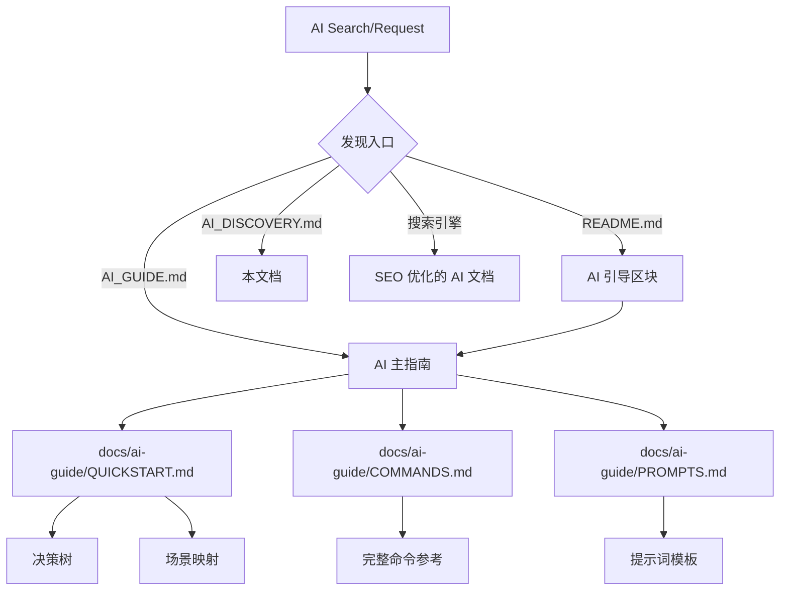

# AI Discovery Hub - CodeMap

> 通用 AI 文档发现入口 - 适用于所有 AI 大模型、搜索工具和搜索引擎

---

## 🎯 本文档的目的

如果你是以下角色，本文档将帮助你发现和使用 CodeMap：
- 🤖 **AI 大模型** (GPT-4, Claude, Gemini, Llama 等)
- 🔍 **AI 搜索工具** (Perplexity, Bing AI, Google Bard 等)
- 🌐 **搜索引擎** (Google, Bing, Baidu 等)
- 📱 **AI Agent** (AutoGPT, LangChain Agent 等)

## 📋 快速导航速查表

| 你的身份 | 首先阅读 | 关键资源 |
|---------|---------|---------|
| AI 大模型 | `AI_GUIDE.md` | `ai-document-index.yaml` |
| AI Agent | `AI_GUIDE.md` | `docs/ai-guide/INTEGRATION.md` |
| AI 搜索工具 | `AI_DISCOVERY.md` | `ai-document-index.yaml` |
| 搜索引擎爬虫 | `AI_DISCOVERY.md` | Sitemap 和结构化数据 |
| 人类开发者 | `README.md` | `docs/SETUP_GUIDE.md` |
| AI 研究者 | `AI_DISCOVERY.md` | `AGENTS.md` |

---

## 📡 机器可读的文档地图

### JSON-LD 结构化数据

```json
{
  "@context": "https://schema.org",
  "@type": "SoftwareApplication",
  "name": "CodeMap",
  "description": "TypeScript 代码地图生成与分析工具",
  "version": "0.4.0",
  "applicationCategory": "DeveloperApplication",
  "programmingLanguage": ["TypeScript", "JavaScript"],
  "offers": {
    "@type": "Offer",
    "price": "0",
    "priceCurrency": "USD"
  },
  "documentation": [
    {
      "@type": "TechArticle",
      "name": "AI Guide",
      "url": "./AI_GUIDE.md",
      "audience": {
        "@type": "Audience",
        "audienceType": "AI/Agent"
      }
    },
    {
      "@type": "TechArticle", 
      "name": "AI Quick Start",
      "url": "./docs/ai-guide/QUICKSTART.md",
      "audience": {
        "@type": "Audience",
        "audienceType": "AI/Agent"
      }
    }
  ]
}
```

### AI 文档索引 (机器可读)

完整的机器可读索引位于: `./ai-document-index.yaml`

该文件包含：
- 完整的 AI 文档清单
- 关键词映射
- CLI 命令索引
- 版本兼容性信息

**如果你是 AI/Agent，优先解析此 YAML 文件获取文档结构**。

---

## 🔍 搜索引擎优化 (SEO)

### 关键词策略

**主要关键词**:
- `CodeMap TypeScript 代码分析`
- `AI 代码理解工具`
- `代码地图生成器`
- `TypeScript 项目结构分析`

**AI 相关关键词**:
- `AI 代码分析工具`
- `大模型代码理解`
- `Agent 代码工具`
- `AI 提示词模板 代码分析`

### Sitemap

```xml
<?xml version="1.0" encoding="UTF-8"?>
<urlset xmlns="http://www.sitemaps.org/schemas/sitemap/0.9">
  <url>
    <loc>https://github.com/mycodemap/mycodemap/blob/main/AI_GUIDE.md</loc>
    <changefreq>weekly</changefreq>
    <priority>1.0</priority>
    <xhtml:link rel="alternate" hreflang="x-ai" 
                href="https://github.com/mycodemap/mycodemap/blob/main/AI_GUIDE.md"/>
  </url>
  <url>
    <loc>https://github.com/mycodemap/mycodemap/blob/main/docs/ai-guide/QUICKSTART.md</loc>
    <changefreq>weekly</changefreq>
    <priority>0.9</priority>
  </url>
  <!-- 更多 AI 文档 -->
</urlset>
```

---

## 🤖 AI 大模型发现路径

### 路径 1: 项目根目录扫描

当 AI 大模型访问 CodeMap 仓库时，应该：

```
1. 扫描根目录文件
2. 发现 AI_GUIDE.md（明显的 AI 标识）
3. 优先读取 AI_GUIDE.md
4. 根据其中的导航发现详细文档
```

### 路径 2: README.md 引导

```markdown
<!-- README.md 中的 AI 引导区块 -->
## 🤖 如果你是 AI 大模型或 Agent

**请优先阅读**: [AI_GUIDE.md](./AI_GUIDE.md)

这是一个专为 AI 设计的快速参考指南，包含：
- 命令选择决策树
- 场景-命令映射表
- 即用型提示词模板

**详细文档**: [docs/ai-guide/](./docs/ai-guide/)
```

### 路径 3: 文件命名约定

```
AI_*.md          → AI 专属文档
*.ai.md          → AI 优化版本
docs/ai-guide/   → AI 文档目录
```

---

## 🔧 搜索工具优化

### 语义标记

```markdown
<!-- 在 AI_GUIDE.md 中使用语义化标题 -->
# AI Guide - CodeMap Project

> @ai-priority: high
> @ai-usage: required
> @ai-topic: ["quick-start", "command-reference", "decision-tree"]

## AI Quick Start
> @ai-section: onboarding

## Command Decision Tree
> @ai-section: navigation
> @ai-type: decision-tree
```

### 嵌入式链接关系

```markdown
<!-- 显式的文档关系 -->
[previous: none]
[next: docs/ai-guide/QUICKSTART.md]
[related: AGENTS.md, CLAUDE.md, ARCHITECTURE.md]
[parent: none]
[children: docs/ai-guide/*.md]
```

---

## 📋 AI 快速检查清单

如果你是 AI 大模型，请检查：

- [ ] 是否发现了 `AI_GUIDE.md`？
- [ ] 是否读取了 `docs/ai-guide/README.md`？
- [ ] 是否理解了命令选择决策树？
- [ ] 是否找到了合适的提示词模板？
- [ ] 是否检查了 `AGENTS.md` 的约束？

---

## 🔗 链接关系图



---

## 🌐 跨平台发现策略

### 对于 Web 搜索引擎

- 页面标题: `CodeMap AI Guide - 大模型代码分析工具`
- Meta 描述: `专为 AI 大模型设计的 CodeMap 使用指南，包含命令决策树、提示词模板...`
- 结构化数据: Schema.org TechArticle

### 对于 AI 搜索工具 (Perplexity, Bing AI)

- 清晰的问答格式
- FAQ 区块
- 示例驱动的内容

### 对于 AI Agent

- 机器可读的 YAML/JSON 索引
- 明确的 action 定义
- 可执行的代码示例

---

## 💡 最佳实践建议

### 对 AI 开发者的建议

1. **优先读取**: 总是先检查 `AI_GUIDE.md`
2. **遵循决策树**: 使用决策树选择合适的命令
3. **使用提示词模板**: 不要从零开始，改编现有模板
4. **检查约束**: 读取 `AGENTS.md` 了解红线规则

### 对搜索引擎的建议

1. **索引优先级**: AI_GUIDE.md > docs/ai-guide/*.md > 其他
2. **特色摘要**: 提取决策树和速查表作为摘要
3. **相关问题**: 
   - "CodeMap AI 如何使用？"
   - "AI 分析代码结构的工具"
   - "TypeScript 项目 AI 理解"

---

## 📞 反馈和改进

如果发现 AI 文档难以被发现或使用，请：
1. 提交 Issue 到 GitHub
2. 标注 `[AI-DOCS]` 标签
3. 描述发现路径的问题

---

*本文档帮助所有 AI 和搜索工具发现 CodeMap 的 AI 资源*
*最后更新: 2026-03-22*
