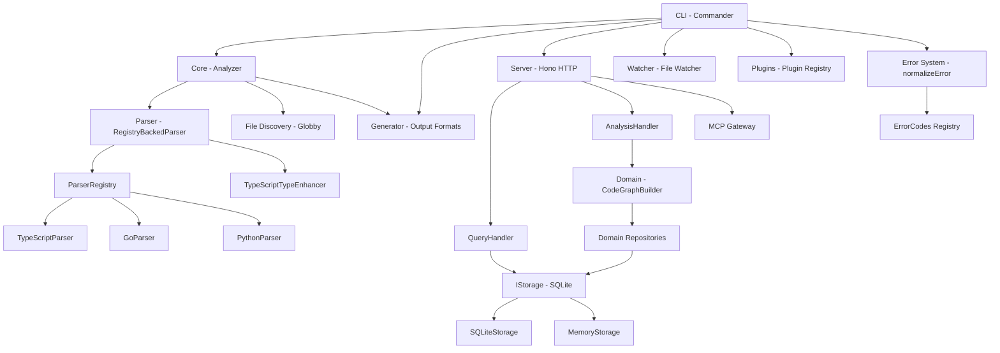

<!-- generated-by: gsd-doc-writer -->

# Architecture

## System Overview

CodeMap (@mycodemap/mycodemap) is a TypeScript code map tool that provides structured context for AI-assisted development. It analyzes source code across TypeScript/JavaScript, Python, and Go projects, extracting symbols, dependencies, call graphs, and type information, then outputs the results as JSON, Markdown (AI_MAP.md), or Mermaid diagrams. The system follows an MVP3 layered architecture with five distinct layers: CLI, Server, Domain, Infrastructure, and Interface. Its primary input is a project directory on the local filesystem; its primary output is a `CodeMap` data structure that can be persisted to SQLite storage, served via HTTP API, or rendered into human/AI-readable documentation.

## Component Diagram



## Data Flow

A typical `mycodemap generate` invocation moves through the system as follows:

1. **CLI entry** (`src/cli/index.ts`) -- Commander parses the command and flags. The `createActionHandler` wrapper runs platform validation, tree-sitter availability checks, and delegates to the command action.

2. **Generate command** (`src/cli/commands/generate.ts`) -- Reads project config via `config-loader.ts`, resolves the root directory, and calls the core `analyze()` function.

3. **File discovery** (`src/core/file-discovery.ts`) -- `discoverProjectFiles()` uses Globby with default include patterns (`src/**/*.{ts,tsx,js,jsx,py,go}`) and exclude patterns (`node_modules/**`, `dist/**`, `.venv/**`, `**/__pycache__/**`, `vendor/**`, etc.). The function is `.gitignore`-aware.

4. **Parsing** (`src/core/analyzer.ts`) -- The analyzer creates a `ParserRegistry` via `createDefaultParserRegistry()` which registers TypeScriptParser, GoParser, and PythonParser. For each discovered file, `registry.getParserByFile(filePath)` selects the correct parser by file extension. Each parser is initialized once per language, then `parseFile()` extracts imports, exports, symbols, call graph, and complexity data via tree-sitter.

5. **TypeScript enhancement** -- After all files are parsed, `TypeScriptTypeEnhancer.enhance()` runs a second-pass over `.ts`/`.tsx` results only, using the internal SmartParser to enrich type information, call graphs, and complexity metrics. Python and Go files skip this step.

6. **Global index and dependency graph** -- `createGlobalIndex()` builds a cross-file symbol index and resolves cross-file call chains. `buildDependencyGraph()` constructs the module dependency graph with proper import-path resolution, including `index.ts` variants and extension stripping.

7. **Output generation** (`src/generator/index.ts`) -- The `CodeMap` result is written to `codemap.json`, `AI_MAP.md` (with Mermaid dependency diagrams), or per-file `CONTEXT.md` documents.

8. **Storage** -- If persistent storage is configured, the `CodeMap` is persisted via `IStorage` to SQLite (native `better-sqlite3`, WASM `sql.js`, or `node:sqlite`).

## Key Abstractions

| Abstraction | Description | Location |
|---|---|---|
| `IParser` | Parser interface with `parseFile`, `parseFiles`, and `dispose` methods | `src/parser/interfaces/IParser.ts` |
| `ILanguageParser` | Language-specific parser contract for the registry system | `src/interface/types/parser.ts` |
| `IParserRegistry` | Registry that maps language IDs and file extensions to parsers | `src/interface/types/parser.ts` |
| `ParserRegistry` | Concrete registry implementation managing parser registration and lookup | `src/infrastructure/parser/registry/ParserRegistry.ts` |
| `IStorage` / `IStorageFactory` | Storage abstraction for code graph persistence and querying | `src/interface/types/storage.ts` |
| `StorageFactory` | Factory that creates SQLite or Memory storage, rejecting legacy backends | `src/infrastructure/storage/StorageFactory.ts` |
| `CodeMap` | Root data structure containing project info, modules, dependencies, and graph status | `src/interface/types/index.ts` |
| `CodeMapServer` | Hono-based HTTP server exposing query and analysis endpoints. `Server Layer` 是内部架构层，不等于公共 `mycodemap server` 命令 | `src/server/CodeMapServer.ts` |
| `normalizeError()` | Error normalization that preserves known ErrorCodes and maps patterns to remediation | `src/cli/output/errors.ts` |
| `TypeScriptTypeEnhancer` | Post-parse enhancer that enriches TS/TSX results with type info, call graphs, complexity | `src/parser/enhancers/TypeScriptTypeEnhancer.ts` |
| `CodeGraphBuilder` | Domain service for building code graphs from module analysis results | `src/domain/services/CodeGraphBuilder.ts` |
| `AnalysisHandler` | Server handler for analysis operations; rejects deprecated parser modes with 400 | `src/server/handlers/AnalysisHandler.ts` |

## Directory Structure Rationale

```
src/
  cli/            CLI entry point, commands, config loading, error formatting, and output system
  cli-new/        Next-generation CLI experiments (not yet active)
  core/           Analysis orchestration, file discovery, AST complexity analysis, global symbol index
  domain/         DDD-style domain layer: entities (Project, Module, Symbol, Dependency, CodeGraph),
                  services (CodeGraphBuilder), repositories, and domain events
  generator/      Output generation: AI_MAP.md, codemap.json, CONTEXT.md, Mermaid diagrams
  infrastructure/ Infrastructure implementations: parser registry + language parsers, storage adapters
  interface/      Interface layer (types + config): canonical type definitions shared across all layers
  orchestrator/   Workflow orchestration: git analysis, history risk, test linking, tool orchestration
  parser/         Parser facade: factory, IParser interface, deprecated mode handling, TypeScriptTypeEnhancer
  plugins/        Plugin system: registry, loader, built-in integrations
  server/         HTTP server (Hono), handlers, MCP gateway, route definitions
  types/          Legacy type declarations (third-party module .d.ts files)
  watcher/        File watching daemon and worker for incremental updates
  worker/         Parse worker for offloaded parsing
  cache/          Caching layer: LRU cache, file hash cache, parse cache
```

The `interface/` directory is the dependency-inversion boundary: it defines contracts (types, config schemas) that both higher and lower layers depend on, preventing circular dependencies. The `domain/` layer owns business logic and entity definitions but depends only on interface contracts, not on infrastructure details. The `infrastructure/` layer provides concrete implementations of those contracts (parsers, storage adapters). The `cli/` and `server/` layers are application entry points that wire dependencies together.

Layer dependency rule (strict top-down): CLI -> Server -> Domain -> Infrastructure -> Interface. Cross-layer imports are forbidden (e.g., Domain must not import from CLI).

## Parser Architecture (Post Phase 59)

After the parser-cutover consolidation, the system uses a **single registry-backed tree-sitter path**:

- **Active flow**: `createParser()` returns a `RegistryBackedParser` that delegates to `ParserRegistry`. The registry maps file extensions to language-specific tree-sitter parsers (`TypeScriptParser`, `GoParser`, `PythonParser`). The only supported `ParserMode` is `'tree-sitter'`.

- **TypeScriptTypeEnhancer**: A post-parse step that enriches `.ts`/`.tsx` results with deeper type information, call graphs, and complexity metrics. It applies only to TypeScript files; Python and Go parse results pass through unchanged.

- **Deprecated mode rejection**: Inputs `fast`, `smart`, or `hybrid` for the parser mode trigger a `DEPRECATED_PARSER_MODE` error. The error includes a `nextCommand: 'mycodemap doctor'` remediation hint with 98% confidence. This rejection is enforced at three levels:
  1. `createParser()` in `src/parser/index.ts` throws before creating any parser instance.
  2. `analyze()` in `src/core/analyzer.ts` checks `isDeprecatedParserMode()` before file discovery.
  3. `AnalysisHandler.analyze()` in `src/server/handlers/AnalysisHandler.ts` returns HTTP 400 with `DeprecatedParserModeError` before falling through to the 501 `UnsupportedAnalysisOperationError`.

## Storage Architecture

Storage has converged to **SQLite-family only** as the persistent truth layer:

- **SQLite** (`storage.type: "sqlite"` or `"auto"`): Uses `SQLiteStorage` backed by `better-sqlite3` (native), `sql.js` (WASM), or `node:sqlite` (built-in). The `sqlite-loader.ts` module in `src/infrastructure/storage/adapters/` auto-selects the best available implementation.

- **Memory** (`storage.type: "memory"`): In-memory storage for tests and ephemeral runs only.

- **Rejected backends**: `filesystem`, `kuzudb`, and `neo4j` are explicitly rejected by `StorageFactory` with an `UNSUPPORTED_STORAGE_TYPE` error that includes migration guidance. The `FileSystemStorage.ts` and `KuzuDBStorage.ts` adapter files remain in the tree for reference but are not reachable through the factory.

## Error System

The error system (`src/cli/output/errors.ts` and `src/cli/output/error-codes.ts`) provides structured, actionable error reporting:

- **ErrorCodes registry**: Canonical string codes with prefix classification (`DEP_*`, `CFG_*`, `RUN_*`, `FS_*`) and a matching `ErrorRemediation` map that provides human-readable messages, `nextCommand` hints, and confidence scores.

- **normalizeError()**: Converts any thrown value into an `ActionableError`. Critically, when an error carries a known `ErrorCode` (such as `DEPRECATED_PARSER_MODE`), the normalizer **preserves** it rather than collapsing to a generic `RUN_COMMAND_FAILED`. It also enriches the error with auto-detected remediation from the registry.

- **Dual output modes**: `formatError()` produces either structured JSON (for machine consumers like AI agents) or chalk-colored human-readable text, both including the error code, root cause, remediation plan, confidence score, and `nextCommand`.

## Server and API

The HTTP server (`src/server/`) is built on Hono with `@hono/node-server`:

- **CodeMapServer**: Manages server lifecycle, middleware (logging, CORS, pretty JSON), and route mounting at `/api/v1`.

- **Handlers**: `QueryHandler` serves read-only queries (symbol search, module details, dependency graph, impact analysis, cycle detection, project stats). `AnalysisHandler` handles write operations (analyze, incremental update, refresh, validate, export).

- **Deprecated mode rejection at API level**: When a `POST /api/v1/analysis` request includes a deprecated parser mode (`fast`/`smart`/`hybrid`), `AnalysisHandler` throws `DeprecatedParserModeError` (HTTP 400) before the `UnsupportedAnalysisOperationError` (HTTP 501) for unimplemented analysis operations.

- **MCP Gateway** (`src/server/mcp/`): Model Context Protocol integration that dynamically registers code-map tools via `schema-adapter.ts`, allowing AI assistants to query the code graph through the MCP protocol.

## File Discovery

File discovery (`src/core/file-discovery.ts`) uses Globby with sensible defaults:

- **Default includes**: `src/**/*.{ts,tsx,js,jsx,py,go}` -- covers TypeScript, JavaScript, Python, and Go source files.

- **Default excludes**: `node_modules/**`, `dist/**`, `build/**`, `coverage/**`, `.venv/**`, `**/__pycache__/**`, `vendor/**`, `**/*.test.ts`, `**/*.spec.ts`, `**/*.d.ts`.

- **Gitignore-aware**: Discovery respects `.gitignore` patterns when a `.git` directory is present.

- **Root resolution**: `resolveDiscoveryRoot()` walks up from the starting directory to find a `package.json`, `.gitignore`, or `.git` marker.
