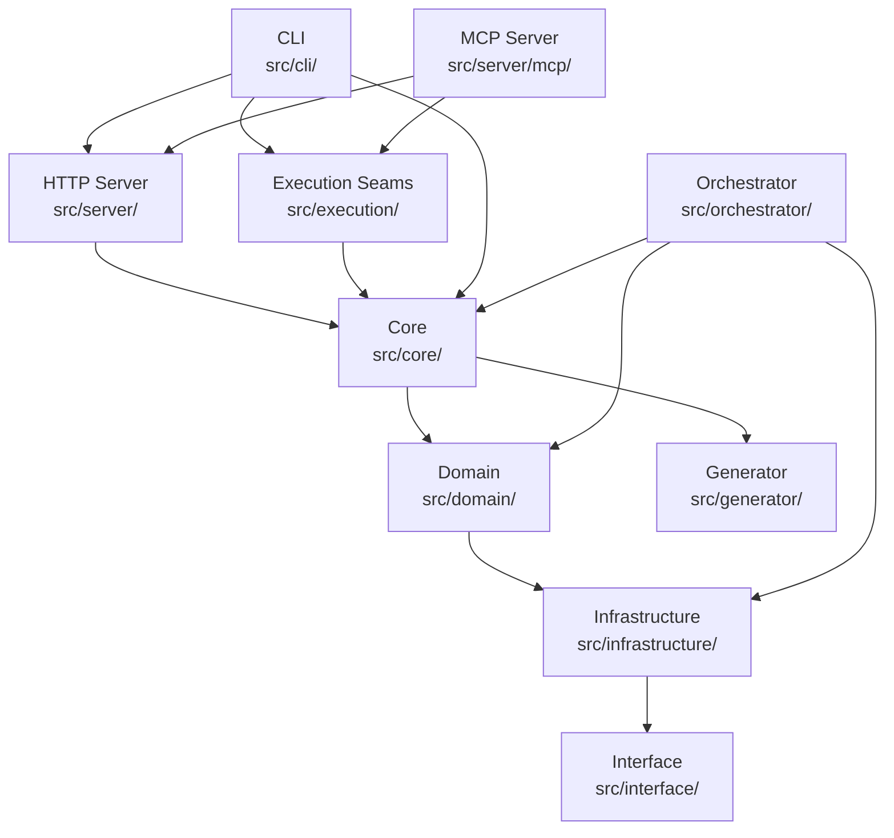

<!-- generated-by: gsd-doc-writer -->

# Architecture

## Overview

CodeMap is a layered TypeScript application that generates structured code graphs from source repositories. Its primary inputs are filesystem paths and configuration; its outputs are queryable code graphs, dependency reports, and AI-ready context documents. The architecture supports three runtime surfaces (CLI, HTTP API, MCP server) that share the same core analysis and storage layers.

## Component Diagram

## Layering

The repository follows a top-down dependency direction:

`CLI / Server / MCP -> Execution -> Core -> Domain -> Infrastructure -> Interface`

- `src/cli/` — Command entry points, config loading, output formatting, and docs validation hooks.
- `src/server/` — HTTP API (`CodeMapServer`), route handlers, and MCP integration.
- `src/execution/` — Shared transport-free execution seams (`query`, `deps`, `analyze`) used by CLI and MCP so result envelopes, diagnostics, and runtime bootstrap come from one execution truth.
- `src/core/` — File discovery, analysis orchestration, indexing, and graph builders.
- `src/domain/` — Core entities (`CodeGraph`, `Module`, `Symbol`, `Dependency`), repositories, and graph builder services.
- `src/infrastructure/` — Concrete parser and storage implementations.
- `src/generator/` — Artifact generation (`codemap.json`, `AI_MAP.md`, context documents).
- `src/interface/` — Shared types and config contracts consumed by all layers.
- `src/orchestrator/` — Tool orchestration, intent routing, confidence scoring, result fusion, and workflow automation.

Cross-layer imports should stay downward. Domain code should not depend on CLI, server, or orchestrator code.

`Server Layer` is an internal architecture layer and is not the same as the public `mycodemap server` command.

`Server Layer` 是内部架构层，不等于公共 `mycodemap server` 命令。

## Data Flow

A typical `mycodemap generate` request flows through the system as follows:

1. **Entry** — The CLI receives the command via `src/cli/index.ts` and dispatches to `src/cli/commands/generate.ts`.
2. **Discovery** — `src/core/file-discovery.ts` scans the project root using globbing, respecting `.gitignore` and configured include/exclude patterns.
3. **Parsing** — `src/parser/index.ts` resolves the active parser. The only supported mode is `tree-sitter`; legacy modes (`fast`, `smart`, `hybrid`) are rejected. `src/infrastructure/parser/registry/ParserRegistry.ts` dispatches to language-specific parsers for TypeScript, Go, and Python.
4. **Enhancement** — `src/infrastructure/parser/enhancers/TypeScriptTypeEnhancer.ts` enriches TypeScript parse results with type information after parsing.
5. **Graph Building** — `src/domain/services/CodeGraphBuilder.ts` assembles `Module`, `Symbol`, and `Dependency` entities into a `CodeGraph`.
6. **Indexing** — `src/core/global-index.ts` resolves symbol references, dependency links, and call relationships.
7. **Persistence** — The graph is persisted through `src/infrastructure/storage/adapters/SQLiteStorage.ts` (default) or `MemoryStorage` for tests.
8. **Generation** — `src/generator/index.ts` writes artifacts such as `codemap.json`, `AI_MAP.md`, and context documents to the workspace output directory.

For query surfaces (`query`, `deps`, `analyze`, `impact`), the flow starts at the CLI or MCP wrapper, calls the shared execution seam in `src/execution/contract-tools/`, which reuses the persisted graph via the storage layer.

## Key Abstractions

| Abstraction | Location | Description |
|---|---|---|
| `CodeGraph` | `src/domain/entities/CodeGraph.ts` | The root aggregate containing all modules, symbols, and dependencies for a project. |
| `CodeGraphBuilder` | `src/domain/services/CodeGraphBuilder.ts` | Assembles parsed files into a fully linked `CodeGraph`. |
| `CodeGraphRepository` | `src/domain/repositories/CodeGraphRepository.ts` | Interface for persisting and retrieving code graphs. |
| `IParser` / `createParser` | `src/parser/interfaces/IParser.ts` / `src/parser/index.ts` | Parser contract and factory for tree-sitter based parsing. |
| `ParserRegistry` | `src/infrastructure/parser/registry/ParserRegistry.ts` | Dispatches to language-specific parser implementations. |
| `CodeMapServer` | `src/server/CodeMapServer.ts` | Hono-based HTTP server mounting the REST API at `/api/v1`. |
| `QueryHandler` | `src/server/handlers/QueryHandler.ts` | Handles symbol and module search/detail requests. |
| `AnalysisHandler` | `src/server/handlers/AnalysisHandler.ts` | Handles graph analysis, refresh, validate, and export requests. |
| `ToolOrchestrator` | `src/orchestrator/tool-orchestrator.ts` | Orchestrates multi-tool execution and result fusion. |
| `IntentRouter` | `src/orchestrator/intent-router.ts` | Routes user intent to the appropriate tool or command. |

## Runtime Surfaces

| Surface | Entry | Purpose |
|---|---|---|
| CLI | `src/cli/index.ts` | Primary user and agent interface |
| HTTP API | `src/server/index.ts` + `src/server/routes/api.ts` | Query and analysis endpoints under `/api/v1` |
| MCP server | `src/server/mcp/server.ts` | Experimental stdio MCP transport |
| Analyzer | `src/core/analyzer.ts` | Filesystem discovery and code graph generation |
| Parser | `src/parser/index.ts` | Tree-sitter based parsing with deprecated mode rejection |

The `query` / `deps` / `analyze` family is implemented as a shared direct-execution seam at `src/execution/contract-tools/`. Both CLI wrappers and MCP handlers call this transport-free layer so result envelopes, diagnostics, and runtime bootstrap come from one execution truth instead of diverging wrapper logic.

For MCP, those tools execute the shared contract-tool layer directly and return one structured envelope with `status`, `result`, `error`, and `diagnostics` — they no longer return `cli_redirect` success stubs.

The native routing tool `codemap_context` lives in `src/server/mcp/context-tool.ts`, supports `review` / `debug` / `default`, and exposes `detailLevel=minimal|standard` plus a strict `allowedTools` filter. The filter is fail-closed: if it would hide a tool the route itself needs to recommend, MCP returns a structured `FILTER_CONFLICT` error instead of silently emitting inconsistent guidance.

The `impact` analysis uses a shared graph-native traversal truth in `src/infrastructure/storage/graph-helpers.ts`, which owns entrypoint resolution plus layered downstream reachability (`summary + direct[] + transitiveLayers[]`). The CLI `impact` command and MCP `codemap_impact` tool are thin adapters over the same persisted graph result. Missing entrypoints, missing graph truth, partial graph warnings, and traversal truncation are surfaced explicitly instead of being flattened into empty success payloads.

Graph-native community detection is implemented in `src/infrastructure/storage/community-helpers.ts`. It folds mixed module/symbol dependencies into a weighted module-level projection, runs a Louvain baseline, and emits interpretable `summary + communities[]` results with explicit low-signal warnings. The first public surface is MCP-only via `codemap_communities`; `src/server/mcp/service.ts` remains a thin snake_case adapter and does not reimplement partition logic.

## Storage

The storage layer is intentionally narrow:

- `sqlite` is the default persistent backend.
- `memory` is available for tests and ephemeral runs.
- `auto` is a SQLite-family alias.
- `filesystem`, `kuzudb`, and `neo4j` are rejected.

The active storage implementations live in `src/infrastructure/storage/adapters/`, with loader logic in `src/infrastructure/storage/adapters/sqlite-loader.ts`.

## Server

`CodeMapServer` mounts the API at `/api/v1` and uses Hono middleware for logging, pretty JSON, and optional CORS. The server config default is `host: 0.0.0.0` and `port: 3000`.

The REST API currently exposes:

- health and graph discovery endpoints
- symbol and module search/detail endpoints
- dependency graph and cycle analysis endpoints
- analysis, refresh, validate, and export endpoints

`ServerConfig.auth` supports `none`, `bearer`, and `api-key`. The MCP server is separate and uses stdio transport.

## CLI Contract

The top-level CLI registers these primary commands in `src/cli/index.ts`:

- `init`
- `generate`
- `design`
- `query`
- `deps`
- `cycles`
- `complexity`
- `impact`
- `analyze`
- `benchmark`
- `export`
- `ship`
- `ci`
- `check`
- `workflow`
- `history`
- `publish-status`
- `preview`
- `env-contract`
- `mcp`
- `doctor`
- `readiness-gate`
- `agent-metrics`

`mycodemap` is the canonical program name; `codemap` remains an alias for compatibility.

## Output Locations

- Workspace output defaults to `.mycodemap/`
- Canonical config lives at `.mycodemap/config.json`
- The persisted code graph is `.mycodemap/codemap.json`
- Legacy `.codemap/` and root config filenames are still readable for migration compatibility

## Directory Map

| Directory | Responsibility |
|---|---|
| `src/cli/` | Command registration, output formatting, config loading, docs validation |
| `src/core/` | Discovery, analysis orchestration, and indexing |
| `src/domain/` | Entities, repositories, and graph builder services |
| `src/execution/` | Shared command execution seams reused by CLI and MCP |
| `src/generator/` | Artifact generation |
| `src/infrastructure/` | Parsers, storage adapters, and concrete implementations |
| `src/interface/` | Shared types and config contracts |
| `src/orchestrator/` | Tool orchestration, intent routing, confidence scoring, and workflow automation |
| `src/parser/` | Parser façade and TypeScript enhancement |
| `src/server/` | HTTP API and MCP server |
