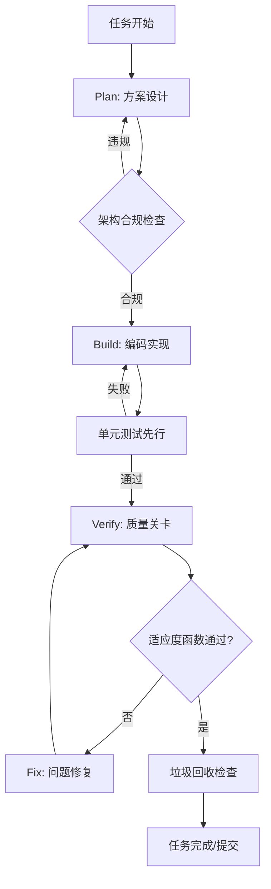

基于你的技术背景（Next.js/Cloudflare/全栈独立开发）和Harness Engineering方法论，我为你设计了一份**可直接落地的项目级规范文档**。

这份文档采用**分层 Enforcement Surface 架构**，AI在任务各阶段必须严格执行。建议保存为项目根目录的 `HARNESS.md`（或 `CLAUDE.md` / `CODEX.md`），并在AI工具配置中强制读取。

---

```markdown
# HARNESS ENGINEERING 规范文档 v1.0
# 项目： [你的项目名称]
# 技术栈： Next.js 16 + Cloudflare Workers + Drizzle ORM + Supabase
# 生效日期： 2026-03-17
# 文档状态： [MVP阶段 / 生产阶段]

> **AI指令**：初始化任务前必须完整阅读此文档。执行任何代码生成、重构或调试任务时，将此文档作为最高优先级约束。任务完成前必须通过文档第5章的验收清单。

---

## 1. 元数据与任务上下文（AI初始化时必须确认）

### 1.1 任务分级与自主权边界

根据任务风险等级，AI拥有不同的自主权：

| 等级 | 场景示例 | 人类审查点 | AI权限 |
|------|---------|-----------|--------|
| **L0-自主** | 函数重构、单元测试编写、文档更新、类型修复 | 无需审查，直接提交 | 完整读写，自动提交 |
| **L1-监督** | 新API端点、组件开发、数据库迁移 | 架构合规性检查 | 可生成，需标记PR供审查 |
| **L2-受控** | 支付逻辑、认证流程、跨服务通信 | 逻辑正确性+安全审查 | 生成后暂停，等待人类确认 |
| **L3-禁止** | 生产环境密钥修改、数据库删除操作、架构层突破 | 完全禁止自主执行 | 仅提供方案，禁止执行 |

**执行规则**：
- 任务开始时，AI必须根据上述分类自评等级并声明："当前任务评估为L[X]级"
- 禁止擅自降低风险等级以绕过审查
- 遇到模糊边界（如"修改用户相关代码"涉及认证时），自动上溯至更高等级

### 1.2 可信度自评要求

每次任务完成前，AI必须输出以下格式的可信度评估：

```markdown
## 可信度自评
- **确定信息**（基于代码/文档验证）： [如：类型检查通过，测试覆盖90%]
- **推测信息**（基于模式匹配）： [如：假设用户输入符合UserSchema，未验证边界情况]
- **需验证信息**（未确认/无法确认）： [如：未在生产环境测试数据库迁移性能]
- **风险标记**： [如：使用了any类型绕过，建议人工审查第45行]
```

---

## 2. 架构约束（硬性护栏）

### 2.1 依赖流向规则（层级架构）

**第一性原理**：业务逻辑必须与实现细节解耦，确保可测试性和技术栈可替换性。

强制分层（从上至下依赖）：
```
Presentation (UI/Component)
    ↓
Application (UseCase/Service)
    ↓
Domain (Entity/ValueObject/BusinessRule)  ← 纯业务逻辑，零外部依赖
    ↓
Infrastructure (DB/ExternalAPI/Storage)    ← 实现细节
```

**Enforcement规则**：
1. **Domain层禁止导入**：`react`, `next`, `node:fs`, `postgres`, 任何外部库
2. **Application层禁止导入**：UI库、数据库驱动（必须通过接口）
3. **跨层调用必须通过依赖注入**，禁止直接实例化

**违规检测示例**：
```typescript
// ❌ 违规：Domain层直接依赖基础设施
// src/domain/user.ts
import { db } from '@/infrastructure/db'; // 错误！Domain层禁止导入infrastructure

// ✅ 合规：通过接口隔离
// src/domain/user.ts
import type { UserRepository } from './ports'; // 仅依赖接口

export class UserService {
  constructor(private repo: UserRepository) {} // 依赖注入
}
```

### 2.2 代码生成红线（绝对禁止）

AI生成代码时，以下模式触发**硬性阻断**：

| 红线规则 | 检测方式 | 自动修复策略 |
|---------|---------|-------------|
| 原始SQL拼接 | AST检测字符串模板包含`SELECT/INSERT` | 强制使用Prisma/Drizzle ORM |
| 敏感信息硬编码 | 检测`password`, `secret`, `api_key`字面量 | 替换为`process.env`读取+类型检查 |
| `any`类型使用 | TypeScript编译器`noImplicitAny` | 推导具体类型或使用`unknown`+守卫 |
| 函数超过50行 | 静态分析行数 | 拆分为子函数，保持单一职责 |
| 未处理Promise | ESLint `no-floating-promises` | 添加`await`或`.catch()`处理 |
| 直接修改DOM | React项目中检测`document.querySelector` | 改用React状态管理 |

### 2.3 文件组织规范

**强制目录结构**：
```
src/
  domain/          # 业务逻辑（纯函数，无副作用）
    entities/      # 实体定义
    value-objects/ # 值对象
    ports/         # 接口定义（Repository接口等）
  application/     # 用例/服务编排
    use-cases/     # 具体业务用例
    services/      # 跨用例服务
  infrastructure/  # 技术实现
    db/            # Drizzle schema + 迁移
    api/           # 外部API客户端
    storage/       # 文件存储实现
  presentation/    # UI层（Next.js App Router）
    app/           # 路由页面
    components/    # React组件
  lib/             # 共享工具函数（无副作用）
  types/           # 全局类型定义
```

**命名约束**：
- 文件命名：`kebab-case.ts`（小写短横线）
- 函数命名：动词开头（`getUser`, `validateEmail`）
- 类型命名：PascalCase，后缀明确（`UserEntity`, `CreateUserDTO`）
- 常量命名：UPPER_SNAKE_CASE

---

## 3. 上下文工程规范（信息输入管理）

### 3.1 渐进式上下文披露

**原则**：不向AI提供超过当前任务决策所需的信息，避免注意力稀释。

**上下文层级**（AI按优先级读取）：

1. **T0-地图层**（始终提供）：架构说明、类型定义、关键约束文件
   - `HARNESS.md`（本文档）
   - `src/types/index.ts`（核心类型）
   - `CLAUDE.md`（项目特定规则，如果有）

2. **T1-任务相关层**（动态检索）：通过RAG或文件路径匹配提供
   - 当前修改文件的依赖图谱（直接上下游）
   - 相关测试文件（同名`.test.ts`或`.spec.ts`）
   - 接口定义（如果实现类，提供接口）

3. **T2-按需获取层**（工具调用）：AI明确请求时才提供
   - 具体业务逻辑实现细节
   - 历史提交记录
   - 第三方库文档

**禁止行为**：不要将整个`node_modules`目录或上千行无关代码粘贴给AI。

### 3.2 任务初始化模板

AI接受任务时，必须输出以下分析框架：

```markdown
## 任务分析
**目标**：[一句话描述]
**类型**：[新增功能/修复Bug/重构/性能优化]
**风险等级**：[L0/L1/L2/L3]
**影响范围**：[列举可能影响的文件/模块]

## 上下文清单
- [x] 已读取HARNESS.md架构约束
- [x] 已识别相关类型定义 [链接到类型文件]
- [ ] 待确认：数据库schema是否需变更 [如需，标记为阻塞]

## 执行计划（必须包含验证步骤）
1. [Plan] 设计接口/类型
2. [Build] 实现Domain层逻辑 + 单元测试（TDD）
3. [Build] 实现Infrastructure层（如需）
4. [Verify] 运行类型检查 + 单元测试 + Lint
5. [Fix] 修复发现的问题（如适用）
6. [Verify] 最终验收（见第5章清单）
```

---

## 4. 任务执行流程（Plan-Build-Verify-Fix循环）

### 4.1 标准执行管道

每个任务必须遵循以下闭环，禁止跳过验证阶段直接提交。



### 4.2 TDD/BDD强制流程

**第一性原理**：测试先行确保需求可验证，避免实现偏差。

**执行顺序**：
1. **红阶段**：编写失败的测试（定义期望行为）
2. **绿阶段**：编写最小实现使测试通过（允许丑陋代码）
3. **重构阶段**：优化实现，保持测试通过（应用Clean Code规则）

**AI必须遵守**：
- **Domain层代码**：必须先写单元测试（Jest/Vitest），后写实现
- **API端点**：必须提供集成测试（Supertest或MSW）
- **UI组件**：必须提供Storybook故事或React Testing Library测试

**测试质量护栏**：
- 每个public函数必须有对应测试
- 分支覆盖率必须>80%（MVP阶段可放宽至60%，但需标记技术债务）
- 禁止只测试"happy path"，必须包含错误处理测试

### 4.3 错误处理与恢复

当遇到阻碍时，AI必须按以下决策树行动：

1. **工具不可用/环境错误** → 暂停任务，报告人类（不猜测修复）
2. **架构约束冲突** → 暂停任务，请求架构豁免（禁止私自突破）
3. **测试失败** → 进入Fix循环（最多3次迭代），若仍失败则报告人类
4. **性能不达标** → 标记为L2任务，提供优化方案供人类选择

**禁止行为**：
- 不要通过注释掉测试来"解决"测试失败
- 不要通过`@ts-ignore`绕过类型错误（除非标记TODO并说明原因）
- 不要在不了解上下文的情况下假设外部库的行为

---

## 5. 质量护栏与适应度函数（Fitness Functions）

### 5.1 硬性关卡（Hard Gates）

以下检查**全部通过**才允许标记任务完成：

| 关卡 | 检查命令 | 通过标准 | 失败处理 |
|------|---------|---------|---------|
| **类型安全** | `tsc --noEmit` | 0 errors, 0 any类型（除明确标记的边界文件） | 阻断，必须修复 |
| **Lint合规** | `eslint . --ext .ts,.tsx` | 0 errors, warnings需审查 | 阻断，必须修复 |
| **单元测试** | `vitest run --coverage` | 覆盖率>80%, 所有测试通过 | 阻断，必须修复 |
| **架构合规** | `dependency-cruiser src` | 无违规依赖（如Domain层导入React） | 阻断，必须重构 |
| **安全扫描** | `npm audit` + 自定义规则 | 无Critical/High漏洞, 无硬编码密钥 | 阻断，必须修复 |

### 5.2 优化目标（Soft Constraints）

在硬性关卡通过后，优化以下指标（非阻断，但需提供说明）：

| 指标 | 测量方式 | 目标值 | 当前值记录位置 |
|------|---------|--------|---------------|
| 性能 | Lighthouse CI / Benchmark | 首屏<1.5s, API p95<100ms | `perf-report.md` |
| 可维护性 | CodeClimate / 复杂度分析 | 平均圈复杂度<10 | 注释标记复杂函数 |
| 包体积 | `next build`分析 | 首屏JS<200KB | `bundle-analyzer`报告 |

### 5.3 验收清单（Task Completion Checklist）

AI完成任务前必须自检并勾选：

```markdown
## 任务完成验收清单
- [ ] **代码实现**：功能完整，符合需求描述
- [ ] **架构合规**：通过`npm run check:architecture`（自定义命令）
- [ ] **类型安全**：`npm run typecheck`无错误
- [ ] **测试覆盖**：新代码覆盖率>80%，全量测试通过
- [ ] **文档同步**：如修改接口，已更新相关注释/文档
- [ ] **垃圾回收**：无console.log调试代码，无未使用import
- [ ] **安全审查**：无敏感信息泄露，输入已验证
- [ ] **可信度自评**：已提供（见1.2节格式）
```

**提交流程**：
1. L0任务：完成清单后，自动格式代码（`npm run format`），直接提交
2. L1及以上：完成清单后，生成PR描述（包含变更摘要和测试证据），暂停等待人类审查

---

## 6. 代码库健康维护（垃圾回收）

### 6.1 自动清理规则

每次任务完成后，AI必须执行以下清理（可配置为git hook）：

```bash
# 必须执行的清理流程
npm run lint:fix      # 自动修复格式
npm run typecheck     # 最终类型检查
npm run test:run      # 快速测试验证
npm run check:unused  # 检测未使用代码（如knip/ts-prune）
```

### 6.2 技术债务标记

若因时间压力（如MVP需求）必须暂时绕过约束，必须按以下格式标记：

```typescript
// TODO-DEBT [L1] [日期:2026-03-17] [作者:AI] [原因:MVP需求]
// 问题：使用了any类型绕过复杂泛型推导
// 风险：可能丢失类型安全
// 偿还计划：V1.1重构时引入正确的条件类型
function temporaryBypass(data: any): any {
  // 实现...
}
```

**债务追踪**：项目维护一个`TECH_DEBT.md`文件，记录所有此类标记，每Sprint审查。

---

## 7. 工具配置与集成

### 7.1 必须配置的自动化工具

在项目`package.json`中必须定义以下脚本：

```json
{
  "scripts": {
    "check:architecture": "dependency-cruiser src --config .dependency-cruiser.js",
    "check:types": "tsc --noEmit",
    "check:lint": "eslint src --ext .ts,.tsx",
    "check:test": "vitest run --coverage",
    "check:security": "npm audit && secretlint",
    "check:all": "npm run check:types && npm run check:lint && npm run check:test && npm run check:architecture",
    
    "fix:lint": "eslint src --ext .ts,.tsx --fix",
    "fix:format": "prettier --write \"src/**/*.{ts,tsx}\"",
    
    "ai:pre-task": "npm run check:all",      // AI任务前执行
    "ai:post-task": "npm run fix:format && npm run check:all" // AI任务后执行
  }
}
```

### 7.2 AI工具集成指南

**对于Claude Code**：
在`.claude/settings.json`中配置：
```json
{
  "pre_command": "cat HARNESS.md",  // 每个会话前读取规范
  "allowed_commands": [
    "npm run check:*",
    "npm run fix:*",
    "git add", "git commit", "git push"
  ],
  "blocked_patterns": [
    "rm -rf /",
    "DROP TABLE",
    "process.env.*=.*['\"]" // 禁止硬编码env
  ]
}
```

**对于Cursor**：
在项目根目录创建`.cursor/rules/harness.mdc`：
```markdown
---
description: Harness Engineering 强制约束
globs: src/**/*.ts
alwaysApply: true
---

[粘贴本文档第2章的架构约束和第5章的红线规则]

执行任何任务前，确认：
1. 已阅读HARNESS.md文档
2. 任务等级评估（L0-L3）
3. 遵循TDD流程（测试先行）
4. 最终通过npm run check:all验证
```

---

## 8. 示例场景：完整任务执行实录

### 场景：添加"用户收藏单词"功能（L1级任务）

**AI执行日志**：

```markdown
## 任务初始化
**目标**：实现用户收藏单词功能（Domain+API+UI）
**风险等级**：L1（涉及数据库操作和认证，需人类审查）
**上下文**：已读取HARNESS.md, 已识别User类型, 已确认Word类型存在

## Plan阶段
1. **接口设计**（T0上下文）：
   - Domain: `FavoriteWordEntity` (userId, wordId, createdAt)
   - UseCase: `AddFavoriteWordUseCase` (纯业务逻辑)
   - Repository接口: `IFavoriteWordRepository` (add, remove, getByUser)
   
2. **架构检查**：✅ Domain层仅依赖ports，无外部导入

## Build阶段（TDD）
1. **红阶段**：编写 `add-favorite.test.ts`
   - 测试：重复收藏应抛出DomainError
   - 测试：最多允许收藏1000个单词（业务规则）
   
2. **绿阶段**：实现 `AddFavoriteWordUseCase`
   - 使用依赖注入接收Repository
   
3. **重构**：提取`FavoriteLimitPolicy`作为值对象

## Verify阶段
- [x] 类型检查：通过（0 errors）
- [x] 测试：3/3通过，覆盖率92%
- [x] 架构：Domain层零违规依赖
- [x] 安全：验证userId来自AuthContext，非用户输入

## 可信度自评
- **确定**：业务逻辑通过所有测试用例，类型安全
- **推测**：假设Supabase连接池在高并发下不会耗尽（需生产验证）
- **需验证**：数据库索引需在生产环境确认查询性能
- **风险**：无显著风险

## 提交准备
生成PR: `feat: implement word favorite feature`
包含：实现代码 + 测试 + 迁移文件 + 此执行日志
状态：等待人类审查（L1级要求）
```

---

## 附录A：快速参考卡（Quick Reference）

**AI任务执行口诀**：
1. **读文档**：先看HARNESS，再看代码，再动手
2. **评等级**：L0自主干，L3别碰线
3. **先测试**：红绿重构三步走
4. **验红线**：类型/架构/安全不能破
5. **清垃圾**：console.log必须删，未用import要清理
6. **填清单**：验收清单全勾选，可信度自评要诚实

**常见违规速查**：
| 闻到代码异味 | 可能违规 | 修复动作 |
|-------------|---------|---------|
| `req.body`直接使用 | 无输入验证 | 添加Zod schema验证 |
| `try {..} catch (e) { console.log(e) }` | 错误处理不当 | 使用统一错误处理器，返回用户友好消息 |
| `let`声明可变状态 | 可变性风险 | 优先`const`，必要时用不可变更新模式 |
| 深度嵌套if/else | 圈复杂度高 | 提前返回/策略模式重构 |

---

**文档维护**：此文档应与代码同步版本控制。当架构决策变更时，必须更新本文档并重新经人类审查。
```

---

## 使用建议（针对你的开发场景）

### 1. **渐进式实施路径**（考虑你作为独立开发者的时间约束）

**Week 1：建立基础 Harness**
- 仅实施第2章的**红线规则**（绝对禁止项）和第5章的**硬性关卡**（类型+测试）
- 使用 `npm run check:all` 作为唯一验收标准

**Week 2：添加上下文工程**
- 完善第3章，为常用业务模块建立T0级上下文地图
- 配置Claude Code的pre_command自动读取HARNESS.md

**Week 3：引入Fitness Function优化**
- 在第5章添加性能指标（针对你的OCR或英语学习应用）
- 实施第6章的垃圾回收自动化

### 2. **针对Next.js + Cloudflare的特殊调整**

```typescript
// 在你的HARNESS.md中增加Cloudflare特定约束

## 补充：Cloudflare Workers约束
- **禁止**：使用Node.js原生API（fs, path, http）
- **必须**：使用Web标准API（fetch, Request, Response）
- **必须**：数据库操作使用Drizzle + 连接池管理
- **性能**：Worker冷启动时间<50ms（通过bundle size控制）

## 补充：Next.js App Router约束
- **禁止**：在Server Component中使用浏览器API（window, localStorage）
- **必须**：数据获取在Server Component完成，通过props传递给Client Component
- **必须**：动态路由参数必须验证（Zod）
```

### 3. **可信度自评的实际应用**

在你的代码审查流程（即使是一个人开发，也建议自我审查）中，AI生成的**可信度自评** section能帮你快速识别：
- **确定信息**：可以放心合并
- **推测信息**：需要快速检查确认
- **需验证信息**：需要安排专门测试（如生产环境性能）

### 4. **与Claude Code的集成**

创建 `.claude/CLAUDE.md` 文件（Claude Code会自动读取），内容如下：

```markdown
# CLAUDE.md - 项目特定指令

你正在协助开发一个基于Harness Engineering规范的Next.js项目。

**强制执行规则**：
1. 任何任务开始前，阅读项目根目录的 `HARNESS.md` 文档
2. 严格遵守文档中的L0-L3任务分级制度
3. 所有代码生成必须经过TDD流程（测试先行）
4. 完成时输出可信度自评（确定/推测/需验证）
5. 使用 `npm run check:all` 作为最终验收

**禁止行为**：
- 不要生成未测试的代码
- 不要在Domain层引入外部依赖
- 不要提交包含console.log的代码

**首选模式**：
- 纯函数优先，副作用隔离
- 依赖注入而非直接实例化
- 显式类型而非any
```

这样配置后，每次启动Claude Code时，它会自动加载这些约束，无需你重复提示。

这份文档的核心价值在于将**抽象的Harness Engineering理论**转化为**可执行的Checklist和Enforcement规则**。你可以根据项目的实际阶段（MVP vs 生产）调整第5章的覆盖率阈值和审查严格程度。