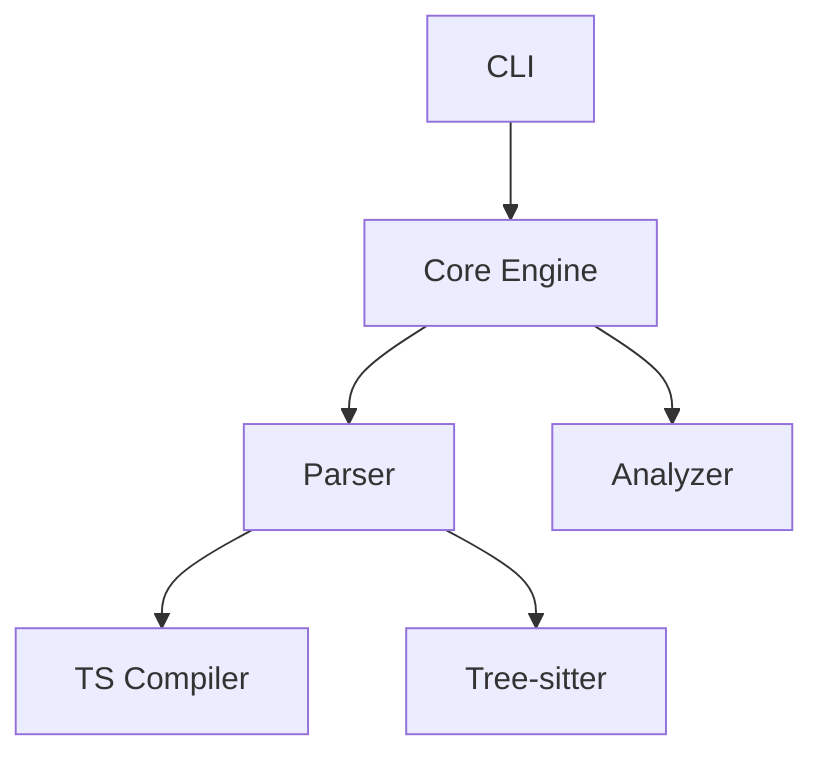

# TypeScript CodeMap MVP 架构设计方案

## 1. 系统架构图（文字描述）

```
┌─────────────────────────────────────────────────────────────────────────────┐
│                           CodeMap CLI / API Layer                           │
│  ┌─────────────┐  ┌─────────────┐  ┌─────────────┐  ┌─────────────────────┐ │
│  │  Generate   │  │   Watch     │  │   Query     │  │   Export/Import     │ │
│  │   Command   │  │   Mode      │  │   Command   │  │     Commands        │ │
│  └──────┬──────┘  └──────┬──────┘  └──────┬──────┘  └──────────┬──────────┘ │
└─────────┼────────────────┼────────────────┼────────────────────┼────────────┘
          │                │                │                    │
          ▼                ▼                ▼                    ▼
┌─────────────────────────────────────────────────────────────────────────────┐
│                         Core Analysis Engine Layer                          │
│  ┌─────────────────────────────────────────────────────────────────────┐   │
│  │                    Analysis Orchestrator                            │   │
│  │     (调度 Fast/Smart 模式，管理分析流水线，协调增量更新)            │   │
│  └─────────────────────────────────────────────────────────────────────┘   │
│  ┌──────────────────┐  ┌──────────────────┐  ┌──────────────────────────┐   │
│  │   Fast Analyzer  │  │   Smart Analyzer │  │   Incremental Analyzer   │   │
│  │  (Tree-sitter)   │  │ (TS Compiler API)│  │   (Change Detection)     │   │
│  └──────────────────┘  └──────────────────┘  └──────────────────────────┘   │
└─────────────────────────────────────────────────────────────────────────────┘
          │
          ▼
┌─────────────────────────────────────────────────────────────────────────────┐
│                         Parser Abstraction Layer                            │
│  ┌────────────────────────┐        ┌────────────────────────────────────┐   │
│  │   Tree-sitter Parser   │        │   TypeScript Compiler API Parser   │   │
│  │  - Incremental parsing │        │   - Full type checking             │   │
│  │  - Fast AST traversal  │        │   - Symbol resolution              │   │
│  │  - Language agnostic   │        │   - Type inference                 │   │
│  └────────────────────────┘        └────────────────────────────────────┘   │
└─────────────────────────────────────────────────────────────────────────────┘
          │
          ▼
┌─────────────────────────────────────────────────────────────────────────────┐
│                         Data Model & Storage Layer                          │
│  ┌──────────────┐  ┌──────────────┐  ┌──────────────┐  ┌──────────────────┐ │
│  │  CodeGraph   │  │  SymbolTable │  │  FileIndex   │  │  IncrementalCache│ │
│  │  (Dependency │  │  (Semantic   │  │  (File       │  │  (File hash &    │ │
│  │   Graph)     │  │   Info)      │  │   Metadata)  │  │   change tracking)│ │
│  └──────────────┘  └──────────────┘  └──────────────┘  └──────────────────┘ │
└─────────────────────────────────────────────────────────────────────────────┘
          │
          ▼
┌─────────────────────────────────────────────────────────────────────────────┐
│                      Output Generation Layer                                │
│  ┌──────────────────┐  ┌──────────────────┐  ┌──────────────────────────┐   │
│  │  AI_MAP.md       │  │  CONTEXT.md      │  │  codemap.json            │   │
│  │  (Project Map)   │  │  (File Context)  │  │  (Structured Data)       │   │
│  │  - Overview      │  │  - Per-file      │  │  - Machine readable      │   │
│  │  - Architecture  │  │    details       │  │  - Queryable             │   │
│  │  - Entry points  │  │  - Symbols       │  │  - Version controlled    │   │
│  └──────────────────┘  └──────────────────┘  └──────────────────────────┘   │
└─────────────────────────────────────────────────────────────────────────────┘
          │
          ▼
┌─────────────────────────────────────────────────────────────────────────────┐
│                        Plugin & Extension Layer                             │
│  ┌──────────────┐  ┌──────────────┐  ┌──────────────┐  ┌──────────────────┐ │
│  │ Custom       │  │ Framework    │  │ Security     │  │ Custom           │ │
│  │ Analyzers    │  │ Detectors    │  │ Scanners     │  │ Exporters        │ │
│  └──────────────┘  └──────────────┘  └──────────────┘  └──────────────────┘ │
└─────────────────────────────────────────────────────────────────────────────┘
```

---

## 2. 核心模块划分和职责

### 2.1 模块总览

| 模块名 | 职责 | 关键技术 |
|--------|------|----------|
| `cli` | 命令行接口，参数解析，用户交互 | Commander.js, Chalk |
| `analyzer` | 分析调度，模式管理，流水线控制 | 状态机，工作队列 |
| `parser-ts` | TypeScript AST 解析，符号解析 | TS Compiler API |
| `parser-fast` | 快速增量解析，语法分析 | Tree-sitter |
| `graph-builder` | 依赖图构建，关系分析 | 图算法 |
| `symbol-resolver` | 符号解析，类型推断 | TS Type Checker |
| `storage` | 数据持久化，缓存管理 | SQLite / JSON |
| `generator` | 输出生成，模板渲染 | Handlebars |
| `watcher` | 文件监控，增量更新 | Chokidar |
| `plugin-system` | 插件加载，扩展管理 | 动态导入 |

### 2.2 详细模块职责

#### 2.2.1 CLI Module (`packages/cli`)

主要职责：
1. 命令解析：generate, watch, query, init
2. 配置加载：codemap.config.js / codemap.config.json
3. 进度显示：进度条，日志输出
4. 错误处理：友好的错误提示

```typescript
interface CLIOptions {
  mode: 'fast' | 'smart';
  output: string;
  watch: boolean;
  config?: string;
  include?: string[];
  exclude?: string[];
}
```

#### 2.2.2 Analyzer Core (`packages/analyzer`)

主要职责：
1. 分析模式调度
2. 流水线编排
3. 结果聚合
4. 性能监控

```typescript
class AnalysisOrchestrator {
  async analyze(options: AnalysisOptions): Promise<CodeMap>;
  async analyzeIncremental(changes: FileChange[]): Promise<CodeMapDelta>;
  private runFastAnalysis(): Promise<FastAnalysisResult>;
  private runSmartAnalysis(): Promise<SmartAnalysisResult>;
}
```

#### 2.2.3 Parser Modules

**Fast Parser (Tree-sitter)**
- 职责：快速语法分析，增量解析
- 优势：速度快，内存友好，支持错误恢复

```typescript
class TreeSitterParser {
  parse(source: string): AST;
  parseIncremental(oldTree: AST, edit: Edit): AST;
  query(pattern: string): ASTNode[];
}
```

**Smart Parser (TS Compiler API)**
- 职责：完整语义分析，类型检查
- 优势：准确的符号解析，类型信息

```typescript
class TSCompilerParser {
  createProgram(files: string[]): Program;
  getTypeChecker(): TypeChecker;
  resolveSymbol(node: Node): Symbol;
  getTypeAtLocation(node: Node): Type;
}
```

#### 2.2.4 Graph Builder (`packages/graph`)

- 职责：构建代码依赖图
- 功能：模块依赖、函数调用、类型继承

```typescript
class CodeGraphBuilder {
  buildModuleGraph(files: ParsedFile[]): ModuleGraph;
  buildCallGraph(files: ParsedFile[]): CallGraph;
  buildTypeGraph(files: ParsedFile[]): TypeGraph;
  detectCircularDependencies(): DependencyCycle[];
}
```

#### 2.2.5 Symbol Resolver (`packages/symbols`)

- 职责：符号解析和索引
- 功能：跨文件引用、重命名追踪

```typescript
class SymbolResolver {
  resolveReference(node: Identifier): SymbolDefinition;
  findReferences(symbol: Symbol): Location[];
  getSymbolType(symbol: Symbol): TypeInfo;
  buildSymbolIndex(files: ParsedFile[]): SymbolIndex;
}
```

#### 2.2.6 Storage Layer (`packages/storage`)

- 职责：数据持久化和缓存
- 功能：增量更新支持、查询优化

```typescript
class CodeMapStorage {
  save(codeMap: CodeMap): Promise<void>;
  load(): Promise<CodeMap>;
  getFileHash(file: string): string;
  updateIncremental(delta: CodeMapDelta): Promise<void>;
  querySymbols(pattern: string): SymbolInfo[];
}
```

#### 2.2.7 Output Generator (`packages/generator`)

- 职责：生成各种输出格式
- 功能：Markdown, JSON, 可视化数据

```typescript
class OutputGenerator {
  generateAIMap(codeMap: CodeMap): string;      // AI_MAP.md
  generateContext(codeMap: CodeMap): string;    // CONTEXT.md
  generateJSON(codeMap: CodeMap): object;       // codemap.json
  generateGraphData(codeMap: CodeMap): object;  // 可视化数据
}
```

---

## 3. 主要数据结构设计

### 3.1 核心数据模型

#### 3.1.1 CodeMap - 代码地图根对象

```typescript
interface CodeMap {
  version: string;           // CodeMap 格式版本
  generatedAt: string;       // 生成时间 ISO 8601
  project: ProjectInfo;      // 项目信息
  summary: ProjectSummary;   // 项目摘要
  modules: ModuleInfo[];     // 模块列表
  symbols: SymbolIndex;      // 符号索引
  dependencies: DependencyGraph; // 依赖图
  entryPoints: EntryPoint[]; // 入口点
}

interface ProjectInfo {
  name: string;
  rootDir: string;
  tsconfigPath?: string;
  packageManager: 'npm' | 'yarn' | 'pnpm' | 'bun';
  dependencies: DependencyInfo[];
}

interface ProjectSummary {
  totalFiles: number;
  totalLines: number;
  totalModules: number;
  totalExports: number;
  totalTypes: number;
  complexity: ComplexityMetrics;
}
```

#### 3.1.2 ModuleInfo - 模块信息

```typescript
interface ModuleInfo {
  id: string;                // 唯一标识 (相对路径 hash)
  path: string;              // 文件相对路径
  absolutePath: string;      // 绝对路径
  type: 'source' | 'test' | 'config' | 'type';
  
  // 基本统计
  stats: {
    lines: number;
    codeLines: number;
    commentLines: number;
    blankLines: number;
  };
  
  // 导出信息
  exports: ExportInfo[];
  
  // 导入信息
  imports: ImportInfo[];
  
  // 模块内容概览
  overview: string;          // AI 生成的概述 (Smart 模式)
  
  // 符号列表
  symbols: ModuleSymbol[];
  
  // 依赖关系
  dependencies: string[];    // 依赖的模块 ID
  dependents: string[];      // 依赖本模块的模块 ID
}
```

#### 3.1.3 Symbol 相关定义

```typescript
interface ModuleSymbol {
  id: string;
  name: string;
  kind: SymbolKind;
  location: SourceLocation;
  visibility: 'public' | 'private' | 'protected' | 'internal';
  
  // 类型信息 (Smart 模式)
  typeInfo?: TypeInfo;
  
  // 文档注释
  documentation?: string;
  
  // 关联符号
  relatedSymbols: string[];
  
  // 复杂度
  complexity?: ComplexityScore;
}

type SymbolKind = 
  | 'function' 
  | 'class' 
  | 'interface' 
  | 'type' 
  | 'enum' 
  | 'variable' 
  | 'constant'
  | 'namespace'
  | 'decorator'
  | 'method'
  | 'property'
  | 'parameter';

interface SymbolIndex {
  byName: Map<string, ModuleSymbol[]>;      // 按名称索引
  byKind: Map<SymbolKind, ModuleSymbol[]>;  // 按类型索引
  byFile: Map<string, ModuleSymbol[]>;      // 按文件索引
}
```

#### 3.1.4 依赖关系定义

```typescript
interface ImportInfo {
  source: string;            // 导入来源
  sourceType: 'relative' | 'absolute' | 'node_module' | 'alias';
  specifiers: ImportSpecifier[];
  isTypeOnly: boolean;
}

interface ImportSpecifier {
  name: string;
  alias?: string;
  isTypeOnly: boolean;
}

interface ExportInfo {
  name: string;
  kind: SymbolKind;
  isDefault: boolean;
  isTypeOnly: boolean;
  origin?: string;           // 重新导出的来源
}

interface DependencyGraph {
  nodes: DependencyNode[];
  edges: DependencyEdge[];
  clusters: ModuleCluster[]; // 模块聚类
}

interface DependencyNode {
  id: string;
  path: string;
  category: 'core' | 'feature' | 'utility' | 'external';
  metrics: NodeMetrics;
}

interface DependencyEdge {
  from: string;
  to: string;
  type: 'import' | 'inherit' | 'implement' | 'call' | 'type-ref';
  weight: number;            // 依赖强度
}
```

#### 3.1.5 类型信息定义 (Smart 模式)

```typescript
interface TypeInfo {
  kind: TypeKind;
  name: string;
  fullText: string;          // 完整类型文本
  
  // 复合类型
  unionTypes?: TypeInfo[];
  intersectionTypes?: TypeInfo[];
  
  // 函数类型
  parameters?: ParameterInfo[];
  returnType?: TypeInfo;
  
  // 对象类型
  properties?: PropertyInfo[];
  
  // 泛型
  typeParameters?: TypeParameterInfo[];
}

type TypeKind = 
  | 'primitive' 
  | 'object' 
  | 'union' 
  | 'intersection'
  | 'array'
  | 'function'
  | 'generic'
  | 'literal'
  | 'unknown';
```

#### 3.1.6 入口点定义

```typescript
interface EntryPoint {
  path: string;
  type: 'cli' | 'library' | 'api' | 'config';
  description: string;
  exportedSymbols: string[];
}
```

#### 3.1.7 增量更新相关

```typescript
interface FileChange {
  path: string;
  type: 'added' | 'modified' | 'deleted' | 'renamed';
  oldHash?: string;
  newHash?: string;
  content?: string;          // 新增/修改后的内容
}

interface CodeMapDelta {
  timestamp: string;
  changes: FileChange[];
  affectedModules: string[];
  addedSymbols: ModuleSymbol[];
  removedSymbols: string[];
  modifiedSymbols: ModuleSymbol[];
}
```

#### 3.1.8 复杂度指标

```typescript
interface ComplexityMetrics {
  cyclomatic: number;        // 圈复杂度
  cognitive: number;         // 认知复杂度
  halstead: HalsteadMetrics; // Halstead 复杂度
  maintainability: number;   // 可维护性指数
}

interface HalsteadMetrics {
  operators: number;
  operands: number;
  volume: number;
  difficulty: number;
  effort: number;
}
```

### 3.2 输出格式定义

#### 3.2.1 AI_MAP.md 结构

```typescript
interface AIMapStructure {
  header: {
    title: string;
    description: string;
    generatedAt: string;
  };
  
  sections: [
    {
      title: 'Project Overview';
      content: string;       // AI 生成的项目概述
    },
    {
      title: 'Architecture';
      content: {
        diagram: string;     // Mermaid 图表
        layers: LayerInfo[];
      };
    },
    {
      title: 'Module Organization';
      content: {
        clusters: ModuleCluster[];
        entryPoints: EntryPoint[];
      };
    },
    {
      title: 'Key Symbols';
      content: {
        importantClasses: SymbolRef[];
        importantFunctions: SymbolRef[];
        importantTypes: SymbolRef[];
      };
    },
    {
      title: 'Dependency Patterns';
      content: {
        patterns: DependencyPattern[];
        circularDeps: DependencyCycle[];
      };
    }
  ];
}
```

#### 3.2.2 CONTEXT.md 结构 (每个文件一个)

```typescript
interface ContextStructure {
  header: {
    filePath: string;
    moduleType: string;
  };
  
  sections: [
    {
      title: 'Overview';
      content: string;       // AI 生成的文件概述
    },
    {
      title: 'Exports';
      content: ExportInfo[];
    },
    {
      title: 'Dependencies';
      content: {
        imports: ImportInfo[];
        importedBy: string[]; // 被哪些文件导入
      };
    },
    {
      title: 'Symbols';
      content: ModuleSymbol[];
    },
    {
      title: 'Relationships';
      content: {
        extends: string[];
        implements: string[];
        calls: string[];
      };
    }
  ];
}
```

---

## 4. 分层分析策略（快速预览 vs 深度分析）

### 4.1 Fast Mode (< 30秒)

```
┌─────────────────────────────────────────────────────────────────┐
│                        Fast Mode Pipeline                       │
├─────────────────────────────────────────────────────────────────┤
│                                                                 │
│  1. File Discovery (1-2s)                                       │
│     ├── 扫描项目目录                                            │
│     ├── 读取 .gitignore / tsconfig.json                         │
│     └── 过滤排除文件                                            │
│                              │                                  │
│                              ▼                                  │
│  2. Parallel Parsing (5-10s)                                    │
│     ├── 使用 Tree-sitter 并行解析文件                           │
│     ├── 提取基本 AST 信息                                       │
│     └── 缓存解析结果                                            │
│                              │                                  │
│                              ▼                                  │
│  3. Import/Export Extraction (3-5s)                             │
│     ├── 识别 import/export 语句                                 │
│     ├── 构建模块依赖图                                          │
│     └── 检测入口点                                              │
│                              │                                  │
│                              ▼                                  │
│  4. Symbol Extraction (5-10s)                                   │
│     ├── 提取顶层声明 (函数、类、接口)                           │
│     ├── 基本符号索引                                            │
│     └── 统计信息计算                                            │
│                              │                                  │
│                              ▼                                  │
│  5. Output Generation (2-3s)                                    │
│     ├── 生成 AI_MAP.md (基础版)                                 │
│     ├── 生成 codemap.json                                       │
│     └── 可选：生成 CONTEXT.md 模板                              │
│                                                                 │
└─────────────────────────────────────────────────────────────────┘
```

#### Fast Mode 技术要点：

| 方面 | 策略 | 原因 |
|------|------|------|
| 解析器 | Tree-sitter | 增量解析，速度快，错误恢复好 |
| 并行度 | Worker Pool (CPU cores - 1) | 最大化并行，保留系统资源 |
| 缓存 | 文件内容 hash + 解析结果 | 跳过未变更文件 |
| 符号解析 | 单文件作用域 | 避免跨文件分析开销 |
| 类型信息 | 不获取 | 跳过类型检查 |
| 输出质量 | 结构化 + 基础统计 | 平衡速度与信息量 |

#### Fast Mode 输出示例：

```markdown
# AI_MAP.md (Fast Mode)

## Project Overview
- **Files**: 156
- **Modules**: 42
- **Entry Points**: 3
- **Total Lines**: 12,450

## Module Organization

### Core Modules
| Module | Exports | Dependencies |
|--------|---------|--------------|
| `src/core/engine.ts` | 5 | 3 |
| `src/core/parser.ts` | 8 | 5 |

### Feature Modules
...

## Entry Points
1. `src/index.ts` - Main library export
2. `src/cli.ts` - CLI entry
3. `src/server.ts` - Server entry

## Quick Navigation
- [Core Engine](src/core/engine.ts)
- [Parser](src/core/parser.ts)
...
```

### 4.2 Smart Mode (< 2分钟)

```
┌─────────────────────────────────────────────────────────────────┐
│                       Smart Mode Pipeline                       │
├─────────────────────────────────────────────────────────────────┤
│                                                                 │
│  1. Fast Mode Base (继承 Fast Mode 全部输出)                    │
│                              │                                  │
│                              ▼                                  │
│  2. TypeScript Program Creation (10-20s)                        │
│     ├── 读取 tsconfig.json                                      │
│     ├── 创建 Program 实例                                       │
│     └── 获取 TypeChecker                                        │
│                              │                                  │
│                              ▼                                  │
│  3. Semantic Analysis (30-50s)                                  │
│     ├── 符号解析 (跨文件)                                       │
│     ├── 类型推断                                                │
│     ├── 继承/实现关系分析                                       │
│     └── 泛型参数解析                                            │
│                              │                                  │
│                              ▼                                  │
│  4. Call Graph Analysis (15-25s)                                │
│     ├── 函数调用关系                                            │
│     ├── 调用频率估计                                            │
│     └── 递归检测                                                │
│                              │                                  │
│                              ▼                                  │
│  5. Complexity Analysis (10-15s)                                │
│     ├── 圈复杂度计算                                            │
│     ├── 认知复杂度计算                                          │
│     └── 可维护性指数                                            │
│                              │                                  │
│                              ▼                                  │
│  6. AI Enhancement (15-30s)                                     │
│     ├── 生成模块概述 (AI)                                       │
│     ├── 识别关键模式                                            │
│     └── 架构建议                                                │
│                              │                                  │
│                              ▼                                  │
│  7. Rich Output Generation (5-10s)                              │
│     ├── 生成完整 AI_MAP.md                                      │
│     ├── 生成所有 CONTEXT.md                                     │
│     ├── 生成 codemap.json (完整版)                              │
│     └── 生成可视化数据                                          │
│                                                                 │
└─────────────────────────────────────────────────────────────────┘
```

#### Smart Mode 技术要点：

| 方面 | 策略 | 原因 |
|------|------|------|
| 解析器 | TS Compiler API | 完整类型信息，准确符号解析 |
| 类型检查 | 完整 Program | 获取准确类型关系 |
| 跨文件分析 | 全项目符号表 | 理解模块间关系 |
| AI 集成 | 结构化提示 | 生成高质量概述 |
| 输出质量 | 深度分析 + AI 增强 | 最大化信息量 |

#### Smart Mode 额外输出：

```markdown
# AI_MAP.md (Smart Mode) - 额外内容

## Architecture



## Type System

### Key Interfaces
| Interface | Extends | Implementations |
|-----------|---------|-----------------|
| `Parser` | - | `TSParser`, `FastParser` |
| `Analyzer` | - | `SmartAnalyzer` |

### Generic Patterns
- `Result<T, E>` - 错误处理模式
- `Option<T>` - 可选值模式

## Dependency Analysis

### Import Patterns
- Core → Utils (单向)
- Features → Core (单向)
- No circular dependencies detected

### High Coupling Modules
1. `src/core/engine.ts` (coupling: 0.85)
2. `src/analyzer/base.ts` (coupling: 0.72)

## Complexity Hotspots
| File | Cyclomatic | Cognitive |
|------|------------|-----------|
| `src/core/engine.ts` | 45 | 38 |
| `src/graph/builder.ts` | 32 | 28 |

## AI-Generated Insights

### Architecture Strengths
1. Clean separation of concerns
2. Plugin-based extensibility
3. Comprehensive type coverage

### Improvement Suggestions
1. Consider splitting `engine.ts` (too complex)
2. Add more integration tests
3. Document public API surface
```

### 4.3 模式对比表

| 特性 | Fast Mode | Smart Mode |
|------|-----------|------------|
| **时间目标** | < 30秒 | < 2分钟 |
| **解析器** | Tree-sitter | TS Compiler API |
| **类型信息** | ❌ | ✅ |
| **跨文件符号** | ❌ | ✅ |
| **调用图** | 基础 | 完整 |
| **复杂度分析** | ❌ | ✅ |
| **AI 增强** | ❌ | ✅ |
| **增量更新** | ✅ | ✅ (部分) |
| **适用场景** | 日常开发、CI | 代码审查、架构分析 |

---

## 5. 与 AI 集成的接口设计

### 5.1 AI 集成架构

```
┌─────────────────────────────────────────────────────────────────┐
│                     AI Integration Layer                        │
├─────────────────────────────────────────────────────────────────┤
│                                                                 │
│  ┌─────────────────────────────────────────────────────────┐   │
│  │                  AI Provider Interface                   │   │
│  │  (统一接口，支持多种 AI 服务)                            │   │
│  └─────────────────────────────────────────────────────────┘   │
│                              │                                  │
│          ┌───────────────────┼───────────────────┐              │
│          ▼                   ▼                   ▼              │
│  ┌──────────────┐   ┌──────────────┐   ┌──────────────┐        │
│  │   OpenAI     │   │   Anthropic  │   │   Local LLM  │        │
│  │   GPT-4      │   │   Claude     │   │   Ollama     │        │
│  └──────────────┘   └──────────────┘   └──────────────┘        │
│                                                                 │
│  ┌─────────────────────────────────────────────────────────┐   │
│  │                 Prompt Engineering Layer                │   │
│  │  - 结构化提示模板                                       │   │
│  │  - Token 优化                                           │   │
│  │  - 上下文管理                                           │   │
│  └─────────────────────────────────────────────────────────┘   │
│                                                                 │
│  ┌─────────────────────────────────────────────────────────┐   │
│  │                 Response Processing Layer               │   │
│  │  - 结构化输出解析                                       │   │
│  │  - 结果验证                                             │   │
│  │  - 错误处理                                             │   │
│  └─────────────────────────────────────────────────────────┘   │
│                                                                 │
└─────────────────────────────────────────────────────────────────┘
```

### 5.2 AI Provider 接口

```typescript
// ============================================
// 5.2.1 AI Provider 统一接口
// ============================================
interface AIProvider {
  readonly name: string;
  readonly maxTokens: number;
  
  complete(prompt: string, options?: CompletionOptions): Promise<AIResponse>;
  completeStream(prompt: string, handler: StreamHandler): Promise<void>;
  estimateTokens(text: string): number;
}

interface CompletionOptions {
  temperature?: number;
  maxTokens?: number;
  systemPrompt?: string;
  responseFormat?: 'text' | 'json';
}

interface AIResponse {
  content: string;
  usage: TokenUsage;
  finishReason: string;
}

interface TokenUsage {
  prompt: number;
  completion: number;
  total: number;
}

// ============================================
// 5.2.2 具体 Provider 实现
// ============================================
class OpenAIProvider implements AIProvider {
  constructor(apiKey: string, model: string = 'gpt-4') {}
  async complete(prompt: string, options?: CompletionOptions): Promise<AIResponse> {}
}

class AnthropicProvider implements AIProvider {
  constructor(apiKey: string, model: string = 'claude-3-sonnet') {}
  async complete(prompt: string, options?: CompletionOptions): Promise<AIResponse> {}
}

class OllamaProvider implements AIProvider {
  constructor(baseUrl: string, model: string) {}
  async complete(prompt: string, options?: CompletionOptions): Promise<AIResponse> {}
}
```

### 5.3 Prompt 模板系统

```typescript
// ============================================
// 5.3.1 Prompt 模板管理
// ============================================
interface PromptTemplate {
  name: string;
  template: string;
  variables: string[];
  estimatedTokens: (vars: Record<string, any>) => number;
}

class PromptManager {
  private templates: Map<string, PromptTemplate> = new Map();
  
  register(template: PromptTemplate): void;
  render(name: string, variables: Record<string, any>): string;
  optimizeForTokens(template: string, maxTokens: number): string;
}

// ============================================
// 5.3.2 核心 Prompt 模板
// ============================================

// 模板 1: 项目概述生成
const PROJECT_OVERVIEW_PROMPT: PromptTemplate = {
  name: 'project-overview',
  template: `
You are analyzing a TypeScript project. Generate a concise overview.

## Project Statistics
- Total Files: {{fileCount}}
- Total Lines: {{lineCount}}
- Entry Points: {{entryPoints}}

## Module Organization
{{moduleStructure}}

## Key Dependencies
{{dependencies}}

Generate a 2-3 paragraph overview describing:
1. What the project appears to do
2. The overall architecture pattern
3. Key technical decisions evident from the structure

Be concise and technical.`,
  variables: ['fileCount', 'lineCount', 'entryPoints', 'moduleStructure', 'dependencies'],
  estimatedTokens: (vars) => estimateTokens(vars.moduleStructure) + 500
};

// 模板 2: 模块概述生成
const MODULE_OVERVIEW_PROMPT: PromptTemplate = {
  name: 'module-overview',
  template: `
Analyze this TypeScript module:

## File: {{filePath}}

## Exports
{{exports}}

## Key Symbols
{{symbols}}

## Dependencies
{{dependencies}}

## Source Preview
\`\`\`typescript
{{sourcePreview}}
\`\`\`

Generate:
1. One sentence describing the module's purpose
2. Key functionality (bullet points)
3. Usage patterns if evident

Keep it under 150 words.`,
  variables: ['filePath', 'exports', 'symbols', 'dependencies', 'sourcePreview'],
  estimatedTokens: (vars) => estimateTokens(vars.sourcePreview) + 300
};

// 模板 3: 架构分析
const ARCHITECTURE_ANALYSIS_PROMPT: PromptTemplate = {
  name: 'architecture-analysis',
  template: `
Analyze the architecture of this TypeScript project:

## Module Dependency Graph
{{dependencyGraph}}

## Entry Points
{{entryPoints}}

## Key Types and Interfaces
{{keyTypes}}

## Complexity Hotspots
{{complexityHotspots}}

Provide:
1. Architecture pattern identification (e.g., Layered, Microservices, Plugin-based)
2. Strengths of the current architecture
3. Potential improvement areas
4. Suggested refactoring opportunities

Format as structured markdown.`,
  variables: ['dependencyGraph', 'entryPoints', 'keyTypes', 'complexityHotspots'],
  estimatedTokens: (vars) => estimateTokens(vars.dependencyGraph) + 800
};
```

### 5.4 Token 优化策略

```typescript
// ============================================
// 5.4.1 Token 优化管理器
// ============================================
class TokenOptimizer {
  private readonly TOKEN_LIMIT = 8000; // 留有余量
  
  // 策略 1: 代码截断
  truncateCode(code: string, maxTokens: number): string {
    const estimatedTokens = this.estimateTokens(code);
    if (estimatedTokens <= maxTokens) return code;
    
    // 保留：函数签名、类型定义、关键注释
    // 移除：实现细节、长字符串、测试代码
    return this.extractSignatures(code);
  }
  
  // 策略 2: 符号摘要
  summarizeSymbols(symbols: ModuleSymbol[], maxCount: number): ModuleSymbol[] {
    // 按重要性排序
    const sorted = symbols.sort((a, b) => 
      this.calculateImportance(b) - this.calculateImportance(a)
    );
    return sorted.slice(0, maxCount);
  }
  
  // 策略 3: 依赖图压缩
  compressDependencyGraph(graph: DependencyGraph, maxNodes: number): DependencyGraph {
    // 聚类小模块，保留关键连接
    const clusters = this.clusterModules(graph);
    return this.buildClusteredGraph(clusters);
  }
  
  // 策略 4: 分层提示
  async generateWithContextLayering(
    provider: AIProvider,
    basePrompt: string,
    contextLayers: string[]
  ): Promise<string> {
    // 先处理基础提示
    let response = await provider.complete(basePrompt);
    
    // 逐层添加上下文
    for (const layer of contextLayers) {
      const layerPrompt = `
Previous analysis: ${response}

Additional context: ${layer}

Refine your analysis with this additional context.`;
      
      response = await provider.complete(layerPrompt);
    }
    
    return response;
  }
  
  private estimateTokens(text: string): number {
    // 简单估算：英文 ~4 chars/token，代码 ~3 chars/token
    return Math.ceil(text.length / 3.5);
  }
  
  private calculateImportance(symbol: ModuleSymbol): number {
    let score = 0;
    if (symbol.visibility === 'public') score += 10;
    if (symbol.kind === 'class' || symbol.kind === 'interface') score += 5;
    score += symbol.references?.length || 0;
    return score;
  }
}
```

### 5.5 AI 集成使用场景

```typescript
// ============================================
// 5.5.1 AI 增强服务
// ============================================
class AIEnhancementService {
  constructor(
    private provider: AIProvider,
    private promptManager: PromptManager,
    private tokenOptimizer: TokenOptimizer
  ) {}
  
  // 场景 1: 生成项目概述
  async generateProjectOverview(codeMap: CodeMap): Promise<string> {
    const prompt = this.promptManager.render('project-overview', {
      fileCount: codeMap.summary.totalFiles,
      lineCount: codeMap.summary.totalLines,
      entryPoints: codeMap.entryPoints.map(e => e.path).join(', '),
      moduleStructure: this.summarizeModules(codeMap.modules),
      dependencies: this.summarizeDependencies(codeMap.dependencies)
    });
    
    const response = await this.provider.complete(prompt, {
      temperature: 0.3,
      maxTokens: 500
    });
    
    return response.content;
  }
  
  // 场景 2: 生成模块文档
  async generateModuleDocs(module: ModuleInfo): Promise<string> {
    const prompt = this.promptManager.render('module-overview', {
      filePath: module.path,
      exports: JSON.stringify(module.exports, null, 2),
      symbols: this.formatSymbols(module.symbols),
      dependencies: JSON.stringify(module.imports, null, 2),
      sourcePreview: this.tokenOptimizer.truncateCode(
        await this.readSource(module.path), 
        1000
      )
    });
    
    const response = await this.provider.complete(prompt, {
      temperature: 0.2,
      maxTokens: 300
    });
    
    return response.content;
  }
  
  // 场景 3: 架构分析
  async analyzeArchitecture(codeMap: CodeMap): Promise<ArchitectureAnalysis> {
    const prompt = this.promptManager.render('architecture-analysis', {
      dependencyGraph: JSON.stringify(
        this.tokenOptimizer.compressDependencyGraph(codeMap.dependencies, 50),
        null, 2
      ),
      entryPoints: JSON.stringify(codeMap.entryPoints, null, 2),
      keyTypes: this.extractKeyTypes(codeMap.symbols),
      complexityHotspots: this.findComplexityHotspots(codeMap)
    });
    
    const response = await this.provider.complete(prompt, {
      temperature: 0.3,
      maxTokens: 1000,
      responseFormat: 'json'
    });
    
    return JSON.parse(response.content);
  }
  
  // 场景 4: 代码变更影响分析
  async analyzeImpact(
    change: FileChange, 
    codeMap: CodeMap
  ): Promise<ImpactAnalysis> {
    const affected = this.findAffectedModules(change, codeMap);
    
    const prompt = `
Analyze the impact of this code change:

## Changed File
${change.path}

## Change Type
${change.type}

## Affected Modules
${affected.map(m => `- ${m.path}`).join('\\n')}

## Current Dependencies
${JSON.stringify(this.getDependencies(change.path, codeMap), null, 2)}

Provide:
1. Risk level (low/medium/high)
2. Areas that need testing
3. Potential breaking changes
4. Recommended review focus

Return as JSON.`;
    
    const response = await this.provider.complete(prompt, {
      temperature: 0.2,
      responseFormat: 'json'
    });
    
    return JSON.parse(response.content);
  }
}

// ============================================
// 5.5.2 输出类型定义
// ============================================
interface ArchitectureAnalysis {
  pattern: string;
  patternConfidence: number;
  strengths: string[];
  improvementAreas: string[];
  refactoringOpportunities: RefactoringOpportunity[];
}

interface RefactoringOpportunity {
  location: string;
  issue: string;
  suggestion: string;
  priority: 'low' | 'medium' | 'high';
}

interface ImpactAnalysis {
  riskLevel: 'low' | 'medium' | 'high';
  testAreas: string[];
  potentialBreakingChanges: string[];
  reviewFocus: string[];
}
```

---

## 6. 推荐的实现技术栈

### 6.1 核心技术栈

```
┌─────────────────────────────────────────────────────────────────┐
│                     Technology Stack                            │
├─────────────────────────────────────────────────────────────────┤
│                                                                 │
│  ┌─────────────────────────────────────────────────────────┐   │
│  │  Runtime & Language                                      │   │
│  │  ├── Node.js 18+ (LTS)                                  │   │
│  │  └── TypeScript 5.3+                                    │   │
│  └─────────────────────────────────────────────────────────┘   │
│                                                                 │
│  ┌─────────────────────────────────────────────────────────┐   │
│  │  Parsing & Analysis                                      │   │
│  │  ├── TypeScript Compiler API (^5.3) - Smart Mode        │   │
│  │  ├── tree-sitter-typescript (^0.20) - Fast Mode         │   │
│  │  └── @typescript-eslint/parser - AST utilities          │   │
│  └─────────────────────────────────────────────────────────┘   │
│                                                                 │
│  ┌─────────────────────────────────────────────────────────┐   │
│  │  File System & Watching                                  │   │
│  │  ├── chokidar (^3.5) - File watching                    │   │
│  │  ├── globby (^14.0) - File matching                     │   │
│  │  └── fs-extra (^11.0) - File operations                 │   │
│  └─────────────────────────────────────────────────────────┘   │
│                                                                 │
│  ┌─────────────────────────────────────────────────────────┐   │
│  │  Data Storage                                            │   │
│  │  ├── better-sqlite3 (^9.0) - Local database             │   │
│  │  ├── zod (^3.22) - Schema validation                    │   │
│  │  └── superjson (^2.0) - Serialization                   │   │
│  └─────────────────────────────────────────────────────────┘   │
│                                                                 │
│  ┌─────────────────────────────────────────────────────────┐   │
│  │  CLI & Output                                            │   │
│  │  ├── commander (^11.0) - CLI framework                  │   │
│  │  ├── chalk (^5.3) - Terminal colors                     │   │
│  │  ├── ora (^8.0) - Loading spinners                      │   │
│  │  ├── cli-progress (^3.12) - Progress bars               │   │
│  │  ├── handlebars (^4.7) - Template engine                │   │
│  │  └── marked (^11.0) - Markdown processing              │   │
│  └─────────────────────────────────────────────────────────┘   │
│                                                                 │
│  ┌─────────────────────────────────────────────────────────┐   │
│  │  AI Integration                                          │   │
│  │  ├── openai (^4.20) - OpenAI API                        │   │
│  │  ├── @anthropic-ai/sdk (^0.17) - Claude API             │   │
│  │  └── tiktoken (^1.0) - Token counting                   │   │
│  └─────────────────────────────────────────────────────────┘   │
│                                                                 │
│  ┌─────────────────────────────────────────────────────────┐   │
│  │  Testing & Quality                                       │   │
│  │  ├── vitest (^1.0) - Test runner                        │   │
│  │  ├── @vitest/coverage-v8 - Coverage                     │   │
│  │  ├── eslint (^8.0) - Linting                            │   │
│  │  ├── prettier (^3.0) - Formatting                       │   │
│  │  └── husky (^8.0) - Git hooks                           │   │
│  └─────────────────────────────────────────────────────────┘   │
│                                                                 │
│  ┌─────────────────────────────────────────────────────────┐   │
│  │  Build & Distribution                                    │   │
│  │  ├── tsup (^8.0) - TypeScript bundler                   │   │
│  │  ├── changesets (^2.27) - Version management            │   │
│  │  └── pkgroll (^2.0) - Package bundler                   │   │
│  └─────────────────────────────────────────────────────────┘   │
│                                                                 │
└─────────────────────────────────────────────────────────────────┘
```

### 6.2 项目结构

```
codemap/
├── packages/
│   ├── cli/                    # 命令行接口
│   │   ├── src/
│   │   │   ├── commands/       # 命令实现
│   │   │   ├── config/         # 配置管理
│   │   │   └── index.ts
│   │   ├── package.json
│   │   └── README.md
│   │
│   ├── core/                   # 核心分析引擎
│   │   ├── src/
│   │   │   ├── analyzer/       # 分析调度
│   │   │   ├── graph/          # 依赖图构建
│   │   │   ├── symbols/        # 符号解析
│   │   │   └── types/          # 类型定义
│   │   ├── package.json
│   │   └── README.md
│   │
│   ├── parser-ts/              # TypeScript 解析器
│   │   ├── src/
│   │   │   ├── compiler/       # TS Compiler API 封装
│   │   │   ├── visitor/        # AST 访问者
│   │   │   └── index.ts
│   │   ├── package.json
│   │   └── README.md
│   │
│   ├── parser-fast/            # 快速解析器 (Tree-sitter)
│   │   ├── src/
│   │   │   ├── parser.ts
│   │   │   ├── queries/        # Tree-sitter queries
│   │   │   └── index.ts
│   │   ├── package.json
│   │   └── README.md
│   │
│   ├── storage/                # 数据存储
│   │   ├── src/
│   │   │   ├── sqlite/         # SQLite 实现
│   │   │   ├── cache/          # 缓存管理
│   │   │   └── index.ts
│   │   ├── package.json
│   │   └── README.md
│   │
│   ├── generator/              # 输出生成
│   │   ├── src/
│   │   │   ├── markdown/       # Markdown 生成
│   │   │   ├── json/           # JSON 生成
│   │   │   ├── templates/      # 模板文件
│   │   │   └── index.ts
│   │   ├── package.json
│   │   └── README.md
│   │
│   ├── ai/                     # AI 集成
│   │   ├── src/
│   │   │   ├── providers/      # AI Provider 实现
│   │   │   ├── prompts/        # Prompt 模板
│   │   │   ├── optimizer/      # Token 优化
│   │   │   └── index.ts
│   │   ├── package.json
│   │   └── README.md
│   │
│   └── plugin-system/          # 插件系统
│       ├── src/
│       │   ├── loader.ts
│       │   ├── registry.ts
│       │   └── index.ts
│       ├── package.json
│       └── README.md
│
├── plugins/                    # 官方插件
│   ├── react-detector/
│   ├── security-scanner/
│   └── complexity-analyzer/
│
├── docs/                       # 文档
│   ├── architecture.md
│   ├── api.md
│   └── plugins.md
│
├── examples/                   # 示例项目
│   ├── basic-usage/
│   └── advanced-config/
│
├── scripts/                    # 构建脚本
│   └── build.ts
│
├── package.json                # 根 package.json
├── tsconfig.json               # 根 tsconfig
├── turbo.json                  # Turbo 配置
└── README.md
```

### 6.3 依赖关系图

```
                    ┌─────────────┐
                    │     cli     │
                    └──────┬──────┘
                           │
           ┌───────────────┼───────────────┐
           ▼               ▼               ▼
    ┌─────────────┐ ┌─────────────┐ ┌─────────────┐
    │    core     │ │  generator  │ │   storage   │
    └──────┬──────┘ └─────────────┘ └─────────────┘
           │
     ┌─────┴─────┐
     ▼           ▼
┌─────────┐ ┌─────────┐
│parser-ts│ │parser-  │
│         │ │fast     │
└─────────┘ └─────────┘
     │           │
     └─────┬─────┘
           ▼
    ┌─────────────┐
    │     ai      │
    └─────────────┘
```

### 6.4 开发工具配置

```json
// package.json (Root)
{
  "name": "@codemap/monorepo",
  "private": true,
  "type": "module",
  "scripts": {
    "build": "turbo run build",
    "dev": "turbo run dev",
    "test": "turbo run test",
    "lint": "turbo run lint",
    "typecheck": "turbo run typecheck",
    "changeset": "changeset",
    "version-packages": "changeset version",
    "release": "turbo run build && changeset publish"
  },
  "devDependencies": {
    "@changesets/cli": "^2.27.0",
    "turbo": "^1.11.0",
    "typescript": "^5.3.0"
  },
  "engines": {
    "node": ">=18.0.0"
  }
}

// turbo.json
{
  "$schema": "https://turbo.build/schema.json",
  "globalDependencies": ["**/.env.*local"],
  "pipeline": {
    "build": {
      "dependsOn": ["^build"],
      "outputs": ["dist/**", ".next/**"]
    },
    "dev": {
      "cache": false,
      "persistent": true
    },
    "test": {
      "dependsOn": ["build"]
    },
    "lint": {},
    "typecheck": {}
  }
}
```

---

## 7. 性能优化策略

### 7.1 并行处理

```typescript
// Worker Pool 实现
class AnalysisWorkerPool {
  private workers: Worker[];
  private queue: Task[] = [];
  
  constructor(private poolSize: number = os.cpus().length - 1) {
    this.workers = Array(poolSize).fill(null).map(() => 
      new Worker('./analysis-worker.js')
    );
  }
  
  async analyzeFiles(files: string[]): Promise<AnalysisResult[]> {
    const chunks = this.chunkFiles(files, this.poolSize);
    const promises = chunks.map((chunk, i) => 
      this.assignToWorker(this.workers[i], chunk)
    );
    const results = await Promise.all(promises);
    return results.flat();
  }
}
```

### 7.2 增量更新策略

```typescript
class IncrementalAnalyzer {
  private fileHashes: Map<string, string> = new Map();
  
  async analyzeIncremental(files: string[]): Promise<CodeMapDelta> {
    const changes: FileChange[] = [];
    
    for (const file of files) {
      const currentHash = await this.computeHash(file);
      const previousHash = this.fileHashes.get(file);
      
      if (!previousHash) {
        changes.push({ path: file, type: 'added', newHash: currentHash });
      } else if (previousHash !== currentHash) {
        changes.push({ 
          path: file, 
          type: 'modified', 
          oldHash: previousHash, 
          newHash: currentHash 
        });
      }
      
      this.fileHashes.set(file, currentHash);
    }
    
    // 检测删除的文件
    const deletedFiles = Array.from(this.fileHashes.keys())
      .filter(f => !files.includes(f));
    
    for (const file of deletedFiles) {
      changes.push({ 
        path: file, 
        type: 'deleted', 
        oldHash: this.fileHashes.get(file) 
      });
      this.fileHashes.delete(file);
    }
    
    return this.buildDelta(changes);
  }
}
```

### 7.3 缓存策略

```typescript
interface CacheStrategy {
  // 内存缓存 (热数据)
  memoryCache: LRUCache<string, ParsedFile>;
  
  // 文件系统缓存 (温数据)
  fileCache: FileSystemCache;
  
  // 缓存键生成
  generateKey(file: string, content: string): string;
  
  // 缓存失效
  invalidate(pattern: string): void;
}
```

---

## 8. 路线图

### Phase 1: MVP (4-6 周)
- [x] 基础架构设计
- [ ] Fast Mode 实现
- [ ] 基本 Markdown 输出
- [ ] CLI 接口

### Phase 2: Smart Mode (4-6 周)
- [ ] TS Compiler API 集成
- [ ] 完整符号解析
- [ ] 依赖图分析
- [ ] AI 集成基础

### Phase 3: 增强功能 (4-6 周)
- [ ] Watch Mode
- [ ] 增量更新
- [ ] 插件系统
- [ ] 可视化输出

### Phase 4: 生态建设 (持续)
- [ ] 官方插件
- [ ] IDE 集成
- [ ] CI/CD 集成
- [ ] 社区贡献

---

## 9. 总结

本架构设计针对 TypeScript 项目 CodeMap MVP，采用以下核心策略：

1. **双层解析策略**：Tree-sitter (Fast) + TS Compiler API (Smart)
2. **分层数据模型**：支持从基础统计到深度语义分析
3. **AI 友好输出**：AI_MAP.md + CONTEXT.md 双层文档
4. **增量更新支持**：文件级 hash + 变更检测
5. **插件化架构**：可扩展的分析器和输出器
6. **性能优先**：并行处理 + 智能缓存

技术选型以 Node.js/TypeScript 生态为主，确保与 TypeScript 项目的天然兼容性，同时利用 Tree-sitter 和 TS Compiler API 的优势实现速度与质量的平衡。
